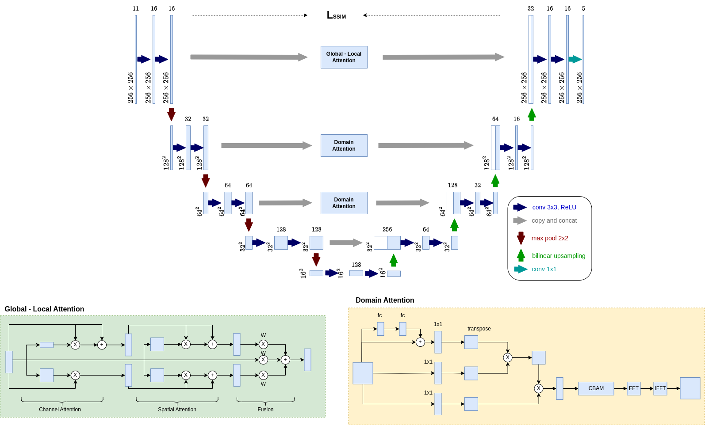

# Domain Adaptive U-Net: Domain Adaptive Semantic segmentation with PyTorch

<a href="https://pytorch.org/"></a>
<a href="#"></a>


Customized implementation of the [U-Net](https://arxiv.org/abs/1505.04597) with domain adaptive module in PyTorch for [Crop And Weed](https://github.com/cropandweed/cropandweed-dataset) from high definition images.

- [Quick start](#quick-start)
- [Description](#description)
- [Usage](#usage)
  - [Training](#training)
  - [Prediction](#prediction)
- [Weights & Biases](#weights--biases)
- [Data](#data)

## Quick start

### Without Docker

1. [Install CUDA](https://developer.nvidia.com/cuda-downloads)

2. [Install PyTorch 1.13 or later](https://pytorch.org/get-started/locally/)

3. Install dependencies
```bash
pip install -r requirements.txt
```

4. Download the data and run training:

For downloading data follow steps on [CropAndWeed](https://github.com/cropandweed/cropandweed-dataset)
```bash
python train.py --amp
```

## Description
This model was trained from scratch with 8k images and scored a [Dice coefficient](https://en.wikipedia.org/wiki/S%C3%B8rensen%E2%80%93Dice_coefficient) of 0.968423 on over 2k test images.

It can be easily used for multiclass segmentation, portrait segmentation, medical segmentation, ...


## Usage
**Note : Use Python 3.6 or newer**


### Training

```console
> python train.py -h
usage: train.py [-h] [--epochs E] [--batch-size B] [--learning-rate LR]
                [--load LOAD] [--scale SCALE] [--validation VAL] [--amp]

Train the UNet on images and target masks

optional arguments:
  -h, --help            show this help message and exit
  --epochs E, -e E      Number of epochs
  --batch-size B, -b B  Batch size
  --learning-rate LR, -l LR
                        Learning rate
  --load LOAD, -f LOAD  Load model from a .pth file
  --scale SCALE, -s SCALE
                        Downscaling factor of the images
  --validation VAL, -v VAL
                        Percent of the data that is used as validation (0-100)
  --amp                 Use mixed precision
```

By default, the `scale` is 0.5, so if you wish to obtain better results (but use more memory), set it to 1.

Automatic mixed precision is also available with the `--amp` flag. [Mixed precision](https://arxiv.org/abs/1710.03740) allows the model to use less memory and to be faster on recent GPUs by using FP16 arithmetic. Enabling AMP is recommended.


### Prediction

After training your model and saving it to `MODEL.pth`, you can easily test the output masks on your images via the CLI.

To predict a single image and save it:

`python predict.py -i image.jpg -o output.jpg`

To predict a multiple images and show them without saving them:

`python predict.py -i image1.jpg image2.jpg --viz --no-save`

```console
> python predict.py -h
usage: predict.py [-h] [--model FILE] --input INPUT [INPUT ...] 
                  [--output INPUT [INPUT ...]] [--viz] [--no-save]
                  [--mask-threshold MASK_THRESHOLD] [--scale SCALE]

Predict masks from input images

optional arguments:
  -h, --help            show this help message and exit
  --model FILE, -m FILE
                        Specify the file in which the model is stored
  --input INPUT [INPUT ...], -i INPUT [INPUT ...]
                        Filenames of input images
  --output INPUT [INPUT ...], -o INPUT [INPUT ...]
                        Filenames of output images
  --viz, -v             Visualize the images as they are processed
  --no-save, -n         Do not save the output masks
  --mask-threshold MASK_THRESHOLD, -t MASK_THRESHOLD
                        Minimum probability value to consider a mask pixel white
  --scale SCALE, -s SCALE
                        Scale factor for the input images
```
You can specify which model file to use with `--model MODEL.pth`.

## Weights & Biases

The training progress can be visualized in real-time using [Weights & Biases](https://wandb.ai/).  Loss curves, validation curves, weights and gradient histograms, as well as predicted masks are logged to the platform.

When launching a training, a link will be printed in the console. Click on it to go to your dashboard. If you have an existing W&B account, you can link it
 by setting the `WANDB_API_KEY` environment variable. If not, it will create an anonymous run which is automatically deleted after 7 days.


## Data
The Crop and Weed data is available on the [Crop And Weed](https://github.com/cropandweed/cropandweed-dataset).


The input images and target masks should be in the `data/imgs` and `data/masks` folders respectively (note that the `imgs` and `masks` folder should not contain any sub-folder or any other files, due to the greedy data-loader). 

You can use your own dataset as long as you make sure it is loaded properly in `utils/data_loading.py`.


---





## Acknowledgments
- We thank the authors of [UNet](https://github.com/milesial/Pytorch-UNet) their open-source codes.
